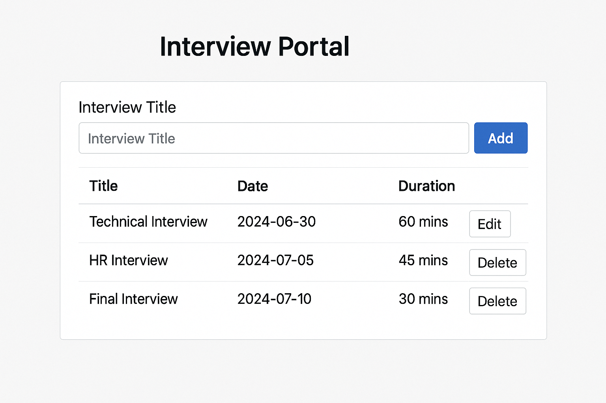

# Interview Creation Portal

This is a React-based web application that allows HR/admins to manage interviews (add, edit, delete).

## Features
- Add interviews
- Edit and delete
- Optional SQLite DB backend

## Getting Started
Run using `npm start` after installing dependencies.

## Tech Used
- React
- SQLite (optional)
- Node.js (optional)

## Screenshot

